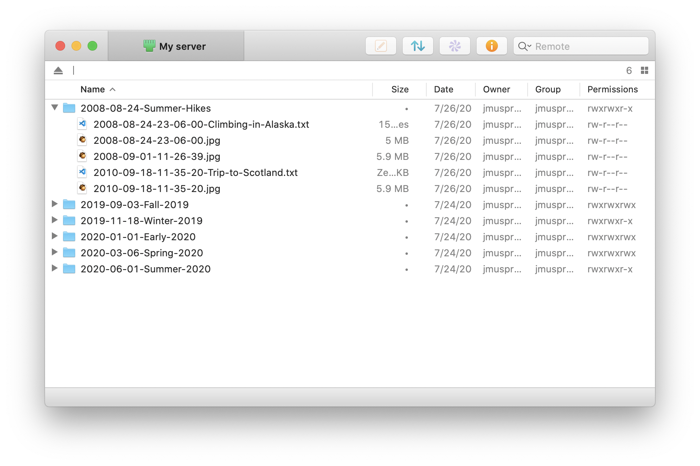
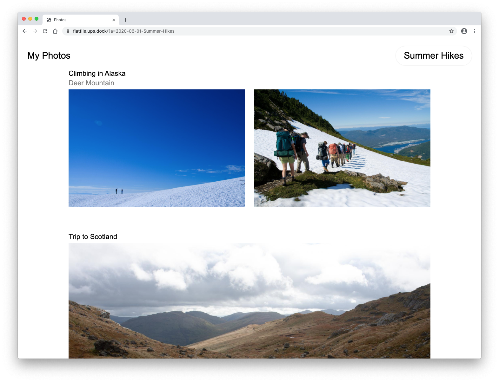

# 📸 Flat File

Flat File creates web galleries from directories of images, video and text files. There's no CMS or admin — just sFTP and date-based file-naming conventions. Built with PHP, [Ups-dock](http://github.com/Upstatement/ups-dock), and vanilla CSS/JS.

## Overview
- Every directory of media becomes an album. Albums are listed and sorted in reverse-chron order on the home page.
- Your high-resolution images get processed into multiple sizes and served as responsive images
- Your videos get processed and served as 720p mp4s.
- Text files become headings
- By default, images/videos are laid out in two columns on laptop and wider screens.
- If there's only one image between headings, it gets a large format treatment.

## Requirements
 - A web server with sFTP access
 - PHP
 - PHP's [GD library](https://www.php.net/manual/en/book.image.php) for image processing
 - [FFMpeg](https://ffmpeg.org) for video encoding
 - [Composer](https://getcomposer.org)

## Installation

### Installing Locally
1. Install Docker and [ups-dock](http://github.com/Upstatement/ups-dock)
2. `cd` to your `flat-file` root diretory
3. Duplicate `www/app/config.example.php` and save as `www/app/config.php`
4. Run `docker build -t flat-file .`
5. Run `docker-compose up`

### Installing on a web server
1. Upload the contents of `/www/` to your server
2. Duplicate `www/app/config.example.php` and save `www/app/config.php`, and edit this copy with paths and URLs for your server
3. Set the permissions of `albums` and `albums-processed` to `777`
4. SSH into the server, `cd` to the root directory, and run `composer install`

## In use
1. Create a new folder locally with a date-based prefix defined in config.php (default is `YYYY-MM-DD-My-Album-Name`)
2. Export your images using the date-based-prefix. [Exiftool](https://exiftool.org) and [a shell script](https://gist.github.com/jmuspratt/3680d45b0c12f8b32093) are useful here if your local photo software doesn't give you enough flexibility.
3. Within an album, add text files to serve as headings above a group of photos, using a date-based prefix to position the heading where you want in the alphabetical file sequence. A file named `2020-05-01-Hiking-in-the-alps.txt` will render as `Hiking in the Alps` right before images and videos prefixed with `2020-05-01-`... You can also add secondary text in the contents of the text file.
4. Visit your site, click the album, and wait for media processing to complete. Subsequent page views will be much faster.
5. [rsync](https://www.digitalocean.com/community/tutorials/how-to-use-rsync-to-sync-local-and-remote-directories) is a great way to sync local albums with your server. To push new photos up and delete anything on the remote server that's local, while preserving file permissions, use something like `rsync -apzP --delete --filter=":- .gitignore" ~/Sites/flat-file/www/albums/ user@123.456.789:/var/www/photos.example.com/html/albums/`

## Development progress

### Done
- [x] Basic responsive layout and styles
- [x] Image processing with GD library
- [x] Video processing (to 720p mp4) with [PHP-FFMPEG](https://github.com/PHP-FFMpeg/PHP-FFMpeg)
- [x] Parse Date-prefixed albums for date and title
- [x] Parse Date-prefixed text files and output as headings
- [x] Native responsive images (`srcset` and `sizes`)
- [x] Native lazyloading with `loading=lazy`
- [x] Separate asset processing from display code and run asynchronously ()
- [x] Improve display of headings on mobile
- [x] Add UI to step through albums from album view (done as dropdown)
- [x] Honor non-16×9 video aspect ratios when processing
- [x] On click, show enlarged images and video (with audio on) in a modal

### To Do
- [ ] Modal lightbox: add photo date, fix tab focus behavior
- [ ] Enhance index page: thumbnails?
- [ ] Add meta tags to album pages

### Maybe
- [ ] Option to use EXIF data for sorting media by date?
- [ ] Option to hide album listing and just show most recent album as the index page
